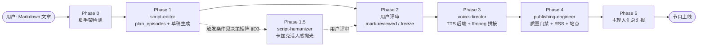
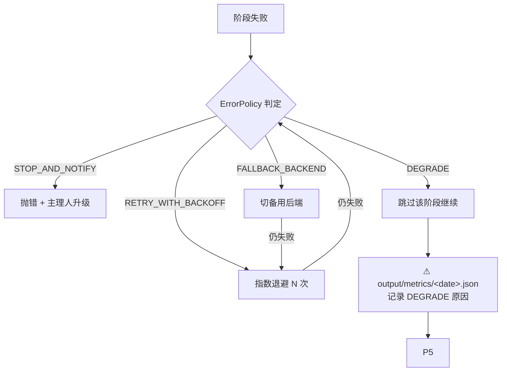

---
# === SOP 元数据（流程治理） ===
name: md-podcast-studio
version: 1.3.0
owner: script-editor                       # SOP 修改权限归属（PR 评审需 owner + 主理人 + 用户）
effective_from: 2026-09-21
changelog_ref: ../../../CHANGELOG.md      # 变更日志相对路径
supersedes: v1.2.2
description: "Self-contained Markdown-to-Podcast pipeline: scaffold a fresh project, split articles into scripts, REQUIRED humanize via Khazix (Phase 1.5, hard-gate C11), direct AI voice (5 backends incl. bundled local qwen3-local / MiniMax / edge-tts / qwen-tts / fish-speech), build RSS + dark site, deploy to GitHub Pages. v1.3.0 repacks scripts/src + templates per the scaffold positioning: merges the real-project evolution (polish→llm rename, +analytics, 2 new TTS backends, edge.py fix) with this package's SOP hardening (Khazix gate, dual-hash resume, ErrorPolicy fallback); bundles the local qwen3-tts service; fixes the P0 where scaffolded projects crashed on build due to 4 missing template assets; makes the Khazix gate operable via a real src.stages CLI; default TTS backend is now qwen3-local; 98 unit tests."
---

# Markdown Podcast Studio — Skill (v1.3.0)

把 Markdown 文章变成可上线播客的完整、可移植流水线。本 skill 自带**已验证可用**的流水线代码与工程模板，能在任意新仓库 scaffold 出一套 Markdown→播客工程。

> **v1.3.0 变更驱动**：本包定位是**脚手架**——`bin/scaffold` 把 `scripts/src/` 原样复制进新工程，
> 所以包内 `src/` 必须是**当前最佳实践、可开箱跑通**的版本。1.3.0 把真实运行仓库的工程演进与本包的 SOP 加固
> **三方合并**，补齐 3 个 P0（模板资产缺失 / 门禁无 CLI / 守护测试缺失），并**内置本地 TTS 服务**。
> 详见 `CHANGELOG.md`。回滚方式见文末。

---

## 何时使用
- 用户想把一篇 Markdown / 长文 / 白皮书变成播客（单人或双人）。
- 需要从零搭建一套文字转语音播客工程（脚手架）。
- 需要排查 prepare / TTS / build / 部署 各环节的问题。
- 用户原话提到"更自然 / 更生动 / 像人念的 / 活人感 / 卡兹克" → 触发 **Phase 1.5**（见决策矩阵）。

## 目录布局（本 skill 内）
- `scripts/src/` — 流水线代码（**脚手架资产**：`bin/scaffold` 会原样复制进新工程，故此处即"当前最佳实践版本"）
- `templates/` — 可移植工程模板：`config.yaml`、`pyproject.toml`、`requirements.txt`/`requirements.lock`、
  `player.js` / `feed.js` / `style.css` / `design-tokens.json`（构建必需，缺一即 crash）、
  `site/`（Jinja2 暗色站点）、`scripts/qwen3-tts-local/` + `scripts/start-qwen-tts-local.sh`（**内置本地 TTS 服务**）、
  `github/workflows/publish.yml`（gh-pages 部署）
- `bin/scaffold` — 在新目录实例化整套工程
- `tests/` — 守护测试（98 个），见 `test_scaffold_contract.py`
- `references/`
  - `command-reference.md` — 精确 CLI 调用（prepare / build / 全序列）
  - `config-spec.md` — `config.yaml` 字段规范（含 v1.1.0 新增 `humanize_stage` / `audio_reviewed`；v1.1.1 撤销 v1.1.0 误诊的 `episode_hash` 字段定义）
  - `hard-constraints.md` — **v1.1.1 删除 v1.1.0 误诊的 C10**，回到 9 条硬约束（团队必守）
  - `troubleshooting.md` — 已知坑与排错
  - `error-policy.md` — **v1.1.0 新增**：4 类错误策略与每阶段应用示例
  - `metrics.md` — **v1.1.0 新增**：每阶段采集指标建议（文档化，实际采集需 src/ 改造）
  - `pii-scan.md` — **v1.1.0 新增**：草稿出口 PII 扫描建议

## 快速开始
```bash
# 1. 在新目录实例化工程（复制代码 + 模板）
bin/scaffold /path/to/my-podcast
cd /path/to/my-podcast

# 2. 安装依赖（Python >=3.13；系统需 ffmpeg/ffprobe，pip 装不了）
python -m venv .venv && . .venv/bin/activate
pip install -r requirements.lock

# 3. 放文章 → 准备草稿 → 人工评审 → 合成与发布
cp article.md raw/$(date +%Y-%m-%d)-article.md
export MINIMAX_API_KEY=...          # minimax 后端需要；edge-tts / qwen3-local 免密
python -m src.prepare --yes
python -m src.prepare --mark-reviewed drafts/<date-slug>          # Phase 2 审稿
python -m src.stages mark-humanize-reviewed drafts/<date-slug>/ep-01.md   # C11 卡兹克门禁放行
python -m src.build drafts/
git add output drafts && git commit -m "new episodes" && git push  # 部署 gh-pages
```

### 五 TTS 后端速选（详细见决策矩阵 §D4）
| 后端 | 密钥 | 何时用 |
|---|---|---|
| `qwen3-local` | 无（需本机起服务） | **模板默认**：本机 Qwen3-TTS，9 预置音色，零成本、零外网依赖（RTF≈2.1）|
| `edge-tts` | 无 | 烟雾测试 / CI / 兜底（`fallback_chain` 默认项）|
| `minimax` | `MINIMAX_API_KEY` | 云 API 主用：单人 / 反思独白 / 商务节目（8 种情绪 + 22 拟声词；voicecaster 仅对此后端生效）|
| `qwen-tts` | `DASHSCOPE_API_KEY` | 阿里云百炼 qwen-tts（云端，无需本机 GPU）|
| `fish-speech` | `FISH_AUDIO_API_KEY` | Fish Audio OpenAudio S2，hosted API；国内访问有 4 坑（见 hard-constraints C9）|

切换**只改 `config.yaml` 的 `tts.backend`**，不改业务代码。`qwen3-local` 用前需先起服务：
```bash
./scripts/start-qwen-tts-local.sh          # → 127.0.0.1:8100；--stop / --status / --fg
```

---

## 主流程图（Happy Path）



## 异常流图（ErrorPolicy 路由）



> 每阶段 ErrorPolicy 详见 `references/error-policy.md`。

---

## 角色分工（与专家团对应）

| 阶段 | 主理人 (A) | 成员 (R) | 用户 (C) | 系统 (I) | 核心动作 |
|---|---|---|---|---|---|
| **Phase 0** 脚手架 | A | R: 自动化脚本 | — | — | `detect_scaffold()`；缺则 `bin/scaffold` |
| **Phase 1** 脚本 | A | R: script-editor | C: 用户（确认选题） | — | 决策门、分集、生成草稿、`ai_stage` 生命周期 |
| **Phase 1.5** 卡兹克（可选）| A | R: script-humanizer | C: 用户（是否触发） | — | in-place 改稿、`humanize_stage` 推进、不动 frontmatter |
| **Phase 2** 评审门 | A | — | **R: 用户** | I: 系统（超时告警） | `ai_stage ∈ {reviewed, frozen}` + `humanize_stage ∈ {reviewed, frozen}` + `audio_reviewed: true` 三门独立 |
| **Phase 3** 配音 | A | R: voice-director | C: 用户（选声） | — | TTS、prosody、ffmpeg 拼接 |
| **Phase 4** 构建发布 | A | R: publishing-engineer | C: 用户（站点名） | I: GitHub Actions | 质量门禁、RSS、暗色站点、`--skip-audio`、gh-pages |
| **Phase 5** 汇报 | **A+R** | — | C: 用户 | I: 全流程 metrics | 集数 / 时长 / 后端 / URL / git status |

> **铁律**：成员产出由对应成员输出后再采信；主理人在 Phase 5 可汇编但不代写成员结论。

---

## 决策矩阵（DecisionMatrix）

> 每个决策点：触发条件 + 推荐 + 兜底。避免"用户原话驱动"的主观性。

### D1 — Phase 0 脚手架检测
- **触发**：用户说"搭工程" / "从零" / "scaffold"
- **检测**：`detect_scaffold()` 检查工程根目录是否含 `src/`、`config.yaml`、`raw/`、`drafts/`、`output/`
- **推荐**：
 - 5 项齐全 → 跳过 Phase 0，直接 Phase 1
 - 缺任意 1 项 → `bin/scaffold` 初始化
- **兜底**：scaffold 失败 → 主理人升级（ErrorPolicy: `STOP_AND_NOTIFY`）

### D2 — Phase 1 plan_episodes fallback
- **触发**：`python -m src.prepare` 调 `plan_episodes(strategy=...)`
- **正常**：`plan_episodes` 返回真实集数（含「短引言合并进第 1 集」）
- **fallback**：`plan_episodes` 失败 / 不可用 → 按 `split.min_episode_chars=600` / `max_episode_chars=3000` 字数估算集数
- **兜底**：估算后再做一次决策门交互让用户确认（ErrorPolicy: `DEGRADE` + 用户咨询）

### D3 — Phase 1.5 卡兹克触发
- **触发条件**（任一满足）：
 1. 用户原话提到"更自然 / 更生动 / 像人念的 / 活人感 / 去 AI 味 / 卡兹克"
 2. `cost_tier ≥ medium`（脚本编辑判断：内容重要程度）
 3. 草稿 `length > 5000 字`
 4. `format == solo`（独白稿天然适合卡兹克）
- **不触发**：纯流水线跑通 / 单期一次性脚本 / 低稿费内容 / 用户已在脚本编辑阶段自带改稿
- **兜底**：卡兹克改稿后 `humanize_stage` 未到 `reviewed` → 不进 Phase 3（ErrorPolicy: `STOP_AND_NOTIFY`）

### D4 — Phase 3 TTS 后端选择
- **默认走 `config.yaml`** 的 `tts.backend`（模板默认为 `qwen3-local`）
- **决策树**（用户没说时主理人按此推荐）：
 - 无外网 / 零成本 / 隐私敏感 → `qwen3-local`（本机服务，需先起 `scripts/start-qwen-tts-local.sh`；RTF≈2.1）
 - 烟雾测试 / CI → `edge-tts`（免密，最稳）
 - 单人 / 反思独白 / 商务节目 → `minimax`（8 情绪 + 22 拟声词）
 - 双人对谈 / 多情感切换 → `minimax`（更稳定）或 `fish-speech`（音色丰富但有 4 坑）
 - 想用云 API 但不用 MiniMax → `qwen-tts`（阿里云百炼，需 `DASHSCOPE_API_KEY`）
 - 国内 CI 网络受限 → `edge-tts` / `qwen3-local` 优先（minimax/fish/qwen-tts 都走外网）
- **兜底**：主后端 5xx 连续 3 次 → 自动切 `edge-tts`（ErrorPolicy: `FALLBACK_BACKEND`）

### D5 — Phase 4 部署路径
- **正常**：`push output/` 触发 `.github/workflows/publish.yml` → gh-pages
- **离线**：`python -m src.build drafts/ --skip-audio` 复用 git-LFS mp3 重渲 RSS/站点
- **本地**：开发机直接预览 `output/index.html`（无需部署）
- **兜底**：gh-pages 部署失败 → 主理人升级（ErrorPolicy: `STOP_AND_NOTIFY`）

---

## RACI 矩阵（治理与代写边界）

> **R** = Responsible（执行）/**A** = Accountable（最终负责）/ **C** = Consulted（咨询）/**I** = Informed（知会）
>
> **铁律**：每个产出有且只有一个 A；成员产出不可由主理人代写。

| 产出 | 主理人 | 脚本编辑 | 卡兹克 | 配音导演 | 发布工程师 | 用户 | 系统 |
|---|:-:|:-:|:-:|:-:|:-:|:-:|:-:|
| 草稿正文 (`drafts/<slug>/ep-XX.md`) | A | **R** | R（Phase 1.5 写回）| — | — | C | — |
| `ai_stage` 推进 | A | **R** | — | — | — | C（评审）| I |
| `humanize_stage` 推进（v1.1.0 新增）| A | — | **R** | — | — | C（评审）| I |
| `audio_reviewed` 推进（v1.1.0 新增）| A | — | — | R（音频评审）| — | C（终裁）| I |
| `episode.mp3`（音频）| A | — | — | **R** | — | C（终裁）| — |
| `output/feed.xml`（RSS）| A | — | — | — | **R** | — | — |
| `output/index.html`（站点）| A | — | — | — | **R** | — | — |
| `output/metrics/<date>.json`（v1.1.0 新增）| **A+R** | — | — | — | — | — | I |
| Phase 5 汇报（最终）| **A+R** | — | — | — | — | C | — |

> **违规检测**：若主理人在 Phase 5 写出"配音导演选了哪个音色"——这是代写，必须由 voice-director 自己回传再采信。

---

## 并行评审配置（v1.1.0 新增，G4）

```yaml
# config.yaml
workflow:
  parallel_review: false   # 默认 false（串行：Phase 1 → Phase 1.5 → Phase 2 评审 → Phase 3 → Phase 4）
                          # true 时：Phase 1.5 与 Phase 2 评审门可并行
                          #   - 用户先评 Phase 1 草稿（ai_stage）
                          #   - 卡兹克并行跑 Phase 1.5 抛光
                          #   - 用户再评卡兹克版（humanize_stage）
                          # 适用：高稿费长稿、双人节奏并行优化
```

> 启用前需确认：用户能并行处理两版（编辑原文 + 卡兹克版），否则节奏反而更乱。

---

## 度量反馈环（v1.1.0 新增，Y4）

每阶段采集的指标建议写到 `output/metrics/<date>.json`，下个迭代可被 SOP 引用（**反馈环入口**）。

| 阶段 | 指标 | 写入 |
|---|---|---|
| Phase 1 | 决策门通过率 / 草稿生成耗时 / LLM token 消耗 | `output/metrics/<date>/phase1.json` |
| Phase 1.5 | 改稿轮次 / 字数漂移率 / 复核脚本失败次数 | `output/metrics/<date>/phase1.5.json` |
| Phase 3 | 后端成功率 / 平均合成耗时 / 音频总时长 | `output/metrics/<date>/phase3.json` |
| Phase 4 | `validate_script` BLOCK 率 / 续跑命中率 / 部署成功率 | `output/metrics/<date>/phase4.json` |
| Phase 5 | **端到端 cycle time**（用户输入到上线的小时数）| `output/metrics/<date>/phase5.json` |

> 当前为**文档化建议**。实际采集需 `scripts/src/` 改造，不在 v1.1.0 范围（冻结资产）。

---

## 回滚（v1.1.0 → v1.0.0）

```bash
# 方式 A：从 git tag 回滚（推荐，绝大多数情况）
cd /Users/jiduobin/.workbuddy/plugins/marketplaces/my-experts/plugins/markdown-podcast-studio
git checkout v1.0.0 -- .

# 方式 B：从物理归档回滚（git 损坏 / tag 误删时）
cd /Users/jiduobin/.workbuddy/plugins/marketplaces/my-experts/plugins/markdown-podcast-studio
```

> **v1.2.2 → v1.2.1-patch**：去掉真实上线沉淀的文档层修正（C12 + 发布验收铁律 + C3 max_tokens 纠正）。`git checkout v1.2.1-patch -- .`。
> **v1.3.0 → v1.2.2**：回滚"脚手架重打包"（`src/` 三方合并 + `templates/` 补齐 + 内置本地 TTS + 98 测试）。`git checkout v1.2.2 -- .`。
> **v1.1.1 → v1.1.0**：把 v1.1.1 误诊的 episode_hash 改名回滚，回 source_hash 真相。`git checkout v1.1.0 -- .`。
> **v1.2.0 → v1.1.1**：把 src/ 实际改造回滚，文档层回归"建议"状态。`git checkout v1.1.1 -- .`。

---

## v1.2.0 治理层新增（src/ 实际改造）

### 候选 1：真 episode_hash（草稿指纹）— `scripts/src/episode_hash.py`
- **目的**：v1.1.1 真相（source_hash 是源稿指纹）+ 卡兹克改稿场景需要"草稿正文指纹"双重比对
- **实现**：`hash_episode_body(body)` 算 SHA256 前 16 位（不含 frontmatter）
- **接入**：`feed.register_episode(..., body=body_text)` 写 manifest；`build.run()` 续跑同时比对 source_hash + episode_hash
- **续跑规则**（`should_resynthesize`）：
 - 任一 hash 缺失（legacy / 首次 build）→ 重生成
 - source_hash 变 → 重生成（raw 改了）
 - episode_hash 变 → 重生成（草稿正文改了，含卡兹克写回 / 用户改字）
 - 都未变 → 跳过

### 候选 2：metrics 实际采集 — `scripts/src/metrics.py`
- **目的**：v1.1.0 文档化的反馈环入口
- **写入路径**：`output/metrics/<date>/phase*.json`（原子写）
- **接入点**：
 - `prepare_file()` 出口 → `emit_phase1(...)`
 - `stages.mark_reviewed()` 出口 → `emit_phase2_review(...)`（best-effort）
 - `build.run_one()` 出口 → `emit_phase3(...)`（含 ErrorPolicy metrics）
- **Timer** 上下文管理器：`with Timer() as t: ... t.duration_sec` 自动记

### 候选 3：PII 扫描接入 — `scripts/src/pii_scan.py`
- **目的**：草稿出口脱敏私人信息（电话 / 邮箱 / 身份证 / 银行卡 / IP）
- **接入点**：`prepare_file()` 草稿落盘前 `pii_scan.process(body, cfg)`
- **报告**：`drafts/<series>/.pii/ep-XX.json`（hidden，build glob 不匹配）
- **配置**（`config.yaml`）：
  ```yaml
  pii:
    enable: true
    patterns: [phone_cn, email, id_card_cn]   # 选启用哪些
    llm_verify: false                          # 关闭（v1.2.1 接线）
  ```
- **失败不阻塞**：扫描失败仅 warn，不阻塞 prepare。

### 候选 4：ErrorPolicy 自动 fallback — `scripts/src/error_policy.py` + `tts.py`
- **目的**：主 backend 5xx 连续失败 → 自动切 fallback（默认 edge-tts）
- **接入点**：`build.run_one()` 调 `tts.build_episode_with_fallback(...)`（替代原 `build_episode_audio`）
- **Fallback chain**：默认 `['edge-tts']`（主 backend 不是 edge-tts 时兜底）；用户可在 `config.yaml` 覆盖 `tts.fallback_chain`
- **重试策略**：每个 backend 内置 3 次重试 + 指数退避（1s → 2s → 4s）
- **Metrics**：`build_episode_with_fallback` 返回 `(mp3, duration, metrics)`，含 `attempted_backends / success_backend / retries_total / degraded`

### 兼容性总结

- `register_episode(..., body="")`：`body` 是 keyword-only，默认 `""`，老调用方式不受影响
- `build_episode_audio(...)` 返回 `(mp3, duration)`：**接口不变**，内部走 fallback 版
- `stages.mark_reviewed(...)`：接口不变，metrics 写入 best-effort
- `prepare_file(...)`：接口不变，内部加 PII 扫描 + metrics

### Smoke Test（v1.2.0 已通过）

详见 `CHANGELOG.md [1.2.0]` 段。已验证：episode_hash 业务逻辑 / should_resynthesize 4 场景 / PII 脱敏 / RetryConfig + is_retryable / metrics emit + read / 全部 9 模块 import + 函数签名。

### Future / Out of Scope（v1.2.1 候选）

- `pii_scan.llm_verify` 真实接线（识别中文姓名等启发式难覆盖）
- `metrics.emit_phase5_summary` 在 build.py:run() 末尾自动调用
- `ErrorPolicy` 文档化的 STOP_AND_NOTIFY / DEGRADE 在 prepare/build 各阶段接入
- unit test 套件（`tests/test_*.py`）
rsync -a --delete .archive/v1.0.0/ ./
```

> 详细命令、配置、约束与排错见 `references/`。**`scripts/src/` 是脚手架资产**（v1.3.0 起口径）：
> `bin/scaffold` 把它原样复制进新工程，所以此处就是"当前最佳实践版本"；包自身演进时随版本一起更新即可，不再需要单独"重新打包"动作。
---

## v1.2.1 治理层新增（卡兹克必做 + 4 候选落地）

### 卡兹克从可选 → 必做强阻断（hard-constraint C11）
- **触发条件**：v1.2.0 卡兹克仅在用户原话触发时跑；v1.2.1 起**默认必做**，build 入口强检查 `humanize_stage ∈ {reviewed, frozen}`
- **门禁调用点**：`build.py:run_one()` Phase 3 入口 → `error_policy.stop_and_notify("phase1.5", ...)` 标准化抛 PipelineError
- **豁免**：`--skip-humanize` flag（CI / 烟雾测试 / 用户显式跳过）
- **生命周期**（`stages.py`）：
 - `skeleton` → prepare 草稿落盘时由 `init_humanize_stage(f)` 初始化
 - `humanized` → 卡兹克改稿完成
 - `reviewed` → 用户评完卡兹克版（`python -m src.stages mark-humanize-reviewed <path>`）
 - `frozen` → 用户 freeze（不再重生成）
- **ErrorPolicy**：卡兹克 LLM 失败 → RETRY(3) → 失败 STOP_NOTIFY（**不**静默降级到原文）

### pii_scan.llm_verify 接线（中文姓名识别）
- **触发条件**：`cfg.pii.llm_verify: true`（默认关闭）
- **设计**：启发式找"上下文疑似姓名"（CEO X / X 先生 / 老师 X 等）→ 调 LLM 二次校验 → 确认的姓名脱敏为 `[已脱敏姓名]`
- **复用**：`llm.llm_complete()`（已有 LLM helper；v1.3.0 起由 `polish.py` 改名而来）
- **失败 fallback**：LLM 调用失败 → 正则-only（不阻塞 prepare/build）
- **Trade-off**：边界严格（lookbehind 排除"汉字+姓名"），宁可漏几个，不要误杀

### metrics.emit_phase5_summary 自动调用
- **触发条件**：`build.py:run()` 末尾无条件 emit
- **采集**：cycle_time_hours（占位 0.0，全 cycle 估算作为 v1.2.2）/ user_review_time_hours / first_attempt_success / phases_succeeded / phases_degraded
- **写入**：`output/metrics/<date>/phase5.json`
- **智能判断 phases_degraded**：`--skip-humanize` 时 phase1.5 列入 degraded，否则 phases_succeeded 含 1.5 + 2

### ErrorPolicy STOP_NOTIFY/DEGRADE 标准化
- **`stop_and_notify(stage, message, hint=None)`**：log error + raise PipelineError。统一入口，便于未来 metrics 接入 + 告警系统。
- **`degrade(stage, message, reason)`**：log warning，不抛错，主流程继续。
- **接入**：build.py 卡兹克门禁失败用 `stop_and_notify("phase1.5", ...)`；其他 raise PipelineError 保留原样（向后兼容）

### Unit Test 套件（v1.2.1 新增）
- **位置**：`tests/test_*.py`
- **覆盖**：episode_hash（9 测试）/ metrics（11）/ pii_scan（11）/ error_policy（13）/ stages（13）
- **运行**：`cd skills/md-podcast-studio/tests && pytest`
- **结果**：**57 passed** ✅
- **conftest.py**：自动加 `scripts/` 到 sys.path，让 pytest 能 import src/
- **不覆盖**：build.py / prepare.py / tts.py（需要外部依赖，集成测试建议）

### 兼容性总结（v1.2.1 不破坏的）

- `build_episode_audio(...)`：返回 `(mp3, duration)`，**接口不变**
- `register_episode(..., body="")`：`body` 是 keyword-only 默认空
- `stages.mark_reviewed(...)`：接口不变
- `prepare_file(...)`：接口不变（内部加 `init_humanize_stage`）

### Smoke Test（v1.2.1 已通过）

详见 `CHANGELOG.md [1.2.1]` 段。

- **57 单测全过**（tests/ 套件）
- **9 模块 import 成功**（build / prepare / feed / stages / tts / episode_hash / metrics / pii_scan / error_policy）
- **卡兹克门禁场景**：草稿 humanize_stage=skeleton → build 抛 PipelineError ✓；--skip-humanize 豁免 ✓
- **PII 姓名启发式**：CEO 张三先生 → "张三" ✓；王女士 + 张先生 → 略过（lookbehind 严格）
- **ErrorPolicy stop_and_notify**：raise PipelineError 含 stage/hint ✓

---

## v1.2.2 治理层新增（**文档层**，来自一次真实上线）

> 本版**不改代码**（`scripts/src/` 当时仍为 v1.2.1 快照；**该限制已在 v1.3.0 解除**）。
> 它是用本专家包真实上线一集播客后，把「会把人带偏」的三处认知修正沉淀进文档。

### 1. `--force` 是一次性诊断，不是终态（hard-constraints **C12**）
- `--force` 让**全部**集数重走 `register_episode()`，而它结尾是 `eps.insert(0, entry)` → 于是：
  - 所有 `shownotes.md` 的 `date` 被刷成当天（实测 82 集多出 ~82 处脏改动）；
  - **manifest / RSS 顺序被打乱**（`build_feed()` **不排序**，数组顺序即发布顺序），新集掉出第 1 位。
- `--skip-audio --force` **仍要跑**（验证渲染路径 + 确认「失败 0」），但**产出的 output 必须还原**再提交。
- 还原判据：`git diff HEAD -- output/manifest.json` = **纯新增、0 删除**。命令见 `references/troubleshooting.md` §7。

### 2. 发布验收：看 blob，不看 HTTP
- gh-pages 部署是**两段**（推分支 → Pages **异步**发 CDN）→ `curl` 滞后会把「还没生效」误判成「发布失败」。
  **权威判据 = `git fetch origin gh-pages` 后的 blob**（`git hash-object` == `git rev-parse origin/gh-pages:<f>`）。
- gh-pages 上 mp3 必须是**裸 blob**（Pages 不支持 LFS），`head -c4` 应为 `ID3`。
- ⚠️ **`index.html` 是纯 JS 外壳**（不含任何系列标题，靠 `feed.js` 运行时 fetch `manifest.json`）
  → **不可用「index.html 里搜不到新系列标题」当故障判据**。
- **顺序断言**：新集必须落在 manifest 第 1 条 + `feed.xml` 第 1 个 `<item>`。

### 3. 纠正 C3 的 `max_tokens` 指引（思考型模型）
- reasoning 与正文**共享** `max_tokens`；**4000 会截断，12000 才稳**。
- 症状：`finish_reason` 正常但 **content 为空**（预算被 reasoning 吃光）。
- `thinking:{type:"disabled"}` **不是所有端点都认**（MiniMax 认，SCNet 忽略）→ 不能当通用省 token 手段。

### 4. 其它新增排错条目（见 `references/troubleshooting.md`）
非交互 shell 不加载 `~/.zshrc`（密钥"看似丢失"）/ `--only` 匹配 `ep-XX` **文件名**而非 slug /
快捷分支丢 duo 音色（**静默降级**，不报错）/ 长任务在 teammate 会话被 SIGKILL /
stdout 块缓冲导致"假卡死"（判活要用服务计数器）/ 整轨静音的检出（`ffmpeg -af volumedetect`）。

### ✅ 已知漂移（**v1.3.0 已消除**）
v1.2.2 记录的「本包 `scripts/src/` 与真实运行仓库分叉」在 **v1.3.0 已解决**（三方合并 + 补齐 P0 + 内置本地 TTS）。

---

## v1.3.0 脚手架重打包（**代码 + 模板层**）

> **一句话**：让 `bin/scaffold` 出的新工程**开箱即能跑到上线**，而不是复制一份旧快照。
> 详见 `CHANGELOG.md [1.3.0]`。

### 1. 三方合并：真实仓库演进 ⊕ 本包 SOP 加固
- **真实仓库侧**：`polish.py` → **`llm.py`** 改名（`pii_scan.py` 4 处引用同步）；新增 **`analytics.py`**；
  TTS 后端 **3 → 5**（新增 `qwen_tts.py` 云 API、`qwen3_local.py` 本机服务；`edge.py` 修"句末弯引号切独立句→空音频"）。
- **本包侧保留**：`episode_hash.py` / `error_policy.py` / `metrics.py` / `pii_scan.py` + C11 门禁 + 双 hash 续跑
  + `build_episode_with_fallback` + `emit_phase1/3/5`。
- ⚠️ **改名陷阱**：守护测试必须**同时断言 `polish` 与 `llm` 两个名字 + AST 级 Call 节点**，
  否则改名后"没人再引用 `polish`"会让旧断言静默通过。

### 2. 修掉的 3 个 P0
| P0 | 现象 | 修法 |
|---|---|---|
| 模板资产缺失 | scaffold 出的工程一 build 就 `FileNotFoundError`（缺 `player.js`/`feed.js`/`style.css`/`design-tokens.json`） | 补齐 4 个资产 + `bin/scaffold` 复制 |
| 门禁无 CLI | 文档要求 `python -m src.stages mark-humanize-reviewed`，但 `stages.py` 没有 `main()` → 门禁不可操作 | 补 `main()` + `mark-reviewed`/`mark-humanize-reviewed`/`show` |
| 守护测试缺失 | 文档引用的 `TestBuildReadOnlyContract` 不存在 | 实现（AST 扫描 `llm`/`polish` 的 import 与 Call） |

### 3. 内置本地 TTS（`templates/scripts/qwen3-tts-local/`）
`server.py` / `synth.py` / `probe_device.py` / `cli.py` / `run.sh` + `start-qwen-tts-local.sh`（`--stop`/`--status`/`--fg`）。
模型权重与独立 venv 不打包，用 `QWEN_TTS_MODEL_PATH` / `QWEN_TTS_VENV` 覆盖。
`templates/config.yaml` 默认后端随之改为 **`qwen3-local`**。

### 4. 验收证据
- **98/98 单测**通过（原 57 + `test_scaffold_contract.py`）。
- **全新 scaffold → 真实构建跑通**：C11 拦截 skeleton → `mark-humanize-reviewed` → build → **edge-tts 真实合成 11s mp3**
  → manifest 双 hash → **再跑 build 幂等（0 变化）**。
- **注入探针**：移走 `templates/player.js` → 对应测试变红 → 还原恢复绿（证明守护测试真的有效）。
